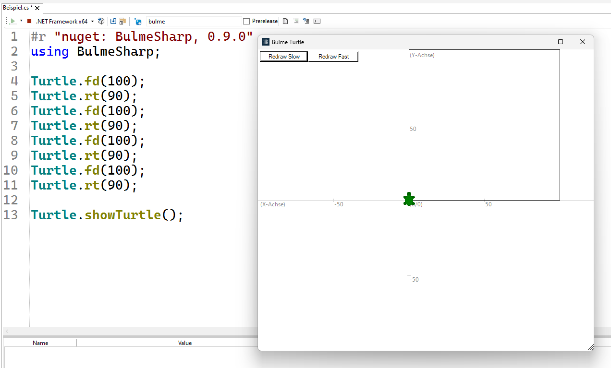

# Grafik mit der Turtle 🐢

Die Turtle ist eine kleine Schildkröte, die eine Spur zeichnet, wenn sie
sich bewegt. Du kannst ihr sagen, sie soll vorwärts gehen oder sich nach
links oder rechts drehen. Indem du diese Anweisungen geschickt
kombinierst, entstehen Zeichnungen und Bilder.

## Minimalprogramm

Bevor du mit der Turtle arbeiten kannst, musst du zuerst eine Bibliothek einbinden.
Eine Bibliothe ist eine Sammlung von vorgefertigten Codebausteinen,
welche normalerweise nicht im Standardumfang einer Programmiersprache enthalten sind,
die du wiederverwenden kannst, um bestimmte Aufgaben schneller und einfacher zu lösen.
Um die Turtle zu verwenden, benötigen wir die Bibliothek *BulmeSharp*.

Das machst du in RoslynPad indem du in der Eingabezeile der "NuGet Bibliotheken"
den Text *BulmeSharp* eingibst und die entsprechende Bibliothek anklickst.
Daraufhin wird folgende Zeile automatisch im Code eingefügt.

```cs
#r "nuget: BulmeSharp, 0.9.0"
```

Um die Bibliothek tatsächlich zu benutzen müssen wir unterhalb noch eine Zeile hinzufügen.

```cs
#r "nuget: BulmeSharp, 0.9.0"
using BulmeSharp;
```


## Bewegen der Turtle

Die Turtle selbst wird in der Programmierung als ein **Objekt** bezeichnet.
Die Fähigkeiten der Turtle, bezeichnen wir in der Programmierung als **Funktionen**.
Um der Turtle zu sagen, dass sie etwas tun soll, müssen wir diese Funktionen **aufrufen**.
 
Funktionsaufrufe der Turtle sind Abkürzungen für englische Begriffe und enden immer mit 
einer öffnenden und einer schließenden **runden** Klammer.
Zwischen den Klammern können weitere Angaben zum Funktionsaufruf stehen.
Diese Angaben nennt man auch **Argumente**.
Selbst wenn keine Argumente nötig sind, muss ein leeres Klammerpaar vorhanden sein.
Damit klar ist, dass eine Funktion des Objekts Turtle gemeint ist,
schreibt man zuerst den Namen des Objekts, gefolgt von einem Punkt
und anschließend den Funktionsaufruf.

In der folgenden Grafik siehst du die wichtigsten Funktionen:


| Funktion  | Beschreibung | Beispiel |
| ------------- | ------------- | ------------- |
| fd  | Abkürzung für **f**orwar**d**, Anzahl Pixel nach vorne gehen  | `Turtle.fd(50);`  |
| bk  | Abkürzung für **b**ac**k**, Anzahl Pixel nach hinten gehen  | `Turtle.bk(18);`  |
| rt  | Abkürzung für **r**igh**t**, Angegebenen Winkel (in Grad) nach **rechts** drehen  | `Turtle.rt(39.5);`  |
| lt  | Abkürzung für **l**ef**t**, Angegebenen Winkel (in Grad) nach **links** drehen  | `Turtle.lt(45);`  |
| showTurtle  | Die Turtle wird am Bildschirm sichtbar gemacht und öffnet das Ausgabefenster.  | `Turtle.showTurtle();`  |

**Zusatz:** Die Einheit für Distanzen ist hier Pixel.
Ein Pixel entspricht einem einzelnen Bildpunkt auf deinem Bildschirm.

**Tipp:** Du kannst auch Zahlen mit Nachkommastellen verwenden.
Jedoch ist das Dezimaltrennzeichen in C# der Punkt "." und nicht das Komma ",".
Das ist deshalb der Fall, da viele der wichtigen Entwicklungen der Informatik 
aus Nordamerika stammen, und dort der Punkt das gängige Dezimaltrennzeichen ist.


## Ein größeres Programm

In der folgenden Abbildung siehst du bereits ein größeres Programm
und daneben die Ausgabe des Programms.



Lass uns das Programm Zeile für Zeile analysieren.
Programme werden immer von oben nach unten abgearbeitet.

In der ersten Zeile wird das NuGet-Paket BulmeSharp in Version 0.9.0 eingebunden.
Dies geschieht mit dem Befehl
```cs
 #r "nuget: BulmeSharp, 0.9.0". 
```
NuGet-Pakete sind Sammlungen von **Bibliotheken**, die wir verwenden können, um den Funktionsumfang unserer Programme zu erweitern.

In der zweiten Zeile 
```cs
using BulmeSharp; 
```
wird der Namensraum *BulmeSharp* importiert, sodass wir die darin enthaltenen **Funktionen** nutzen können. Ähnlich wie bei Modulen in anderen Sprachen erweitern solche Bibliotheken die Fähigkeiten unseres Programms.

Ab Zeile **4** beginnen die Turtle-Befehle:
In `Turtle.fd(100);` fährt die Turtle 100 Pixel nach vorne.

In Zeile **5** dreht sich die Turtle mit `Turtle.rt(90);` um 90 Grad nach rechts.

In Zeile **6 und 7** fährt die Turtle wieder 100 Pixel nach vorne und dreht sich erneut um 90 Grad nach rechts.

Die Schritte in den Zeilen **8,9,10 und 11** wiederholen sich, sodass die Turtle weiter 100 Pixel fährt, sich dreht und schlussendlich wieder an ihrem Ausgangspunkt ankommt, nachdem sie ein Quadrat gezeichnet hat.

In der letzten Zeile `Turtle.showTurtle();` wird die Turtle am Bildschirm sichtbar gemacht, damit wird auch das Anzeigefenster geöffnet.

Das Programm zeichnet also ein Quadrat mit einer Seitenlänge von 100 Pixeln und zeigt die Turtle am Ende an.

## 🧭 Zusammenfassung
Wir haben uns die wichtigsten Funktionen der Turtle in C# angesehen. 

Funktionen haben am Ende zwei runde Klammern. Zwischen den runden Klammern können Argumente stehen, das sind weitere Angaben zum Funktionsaufruf, beispielsweise die Anzahl der Pixel bei der Funktion `fd(100)`.

Damit klar ist, dass die Funktion `fd` des Objekts `Turtle` gemeint ist,  
schreibt man zuerst den Namen des Objekts, gefolgt von einem Punkt und anschließend den Funktionsaufruf.

In C# müssen Funktionsaufrufe mit einem Semikolon `;` abgeschlossen werden, um das Ende der Anweisung zu markieren.

Im nächsten Abschnitt sollst du selbst Programme schreiben, um vorgegebene Grafiken zu erzeugen.


