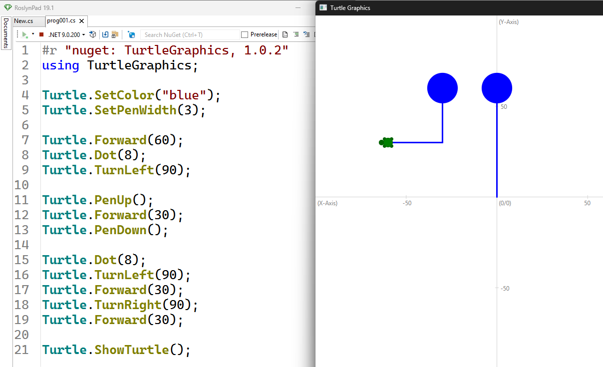

# Grafik mit der Turtle 🐢

Die Turtle ist eine kleine Schildkröte, die eine Spur zeichnet, wenn sie
sich bewegt. Du kannst ihr sagen, sie soll vorwärts gehen oder sich nach
links oder rechts drehen. Indem du diese Anweisungen geschickt
kombinierst, entstehen Zeichnungen und Bilder.

## Minimalprogramm

Bevor du mit der Turtle arbeiten kannst, musst du zuerst eine Bibliothek einbinden.
Eine Bibliothek ist eine Sammlung von vorgefertigten Codebausteinen,
welche normalerweise nicht im Standardumfang einer Programmiersprache enthalten sind,
die du wiederverwenden kannst, um bestimmte Aufgaben schneller und einfacher zu lösen.
Um die Turtle zu verwenden, benötigen wir die Bibliothek *BulmeSharp*.

Das machst du in RoslynPad indem du in der Eingabezeile der "NuGet Bibliotheken"
den Text *BulmeSharp* eingibst und die entsprechende Bibliothek anklickst.
Daraufhin wird folgende Zeile automatisch im Code eingefügt.

```cs
#r "nuget: TurtleGraphics, 1.0.2"
```

Um die Bibliothek tatsächlich zu benutzen müssen wir unterhalb noch eine Zeile hinzufügen.

```cs
#r "nuget: TurtleGraphics, 1.0.2"
using TurtleGraphics;
```


## Bewegen der Turtle

Die Turtle selbst wird in der Programmierung als ein **Objekt** bezeichnet.
Die Fähigkeiten der Turtle, bezeichnen wir in der Programmierung als **Funktionen**.
Um der Turtle zu sagen, dass sie etwas tun soll, müssen wir diese Funktionen **aufrufen**.
 
Funktionsaufrufe der Turtle sind Abkürzungen für englische Begriffe und enden immer mit 
einer öffnenden und einer schließenden **runden** Klammer.
Zwischen den Klammern können weitere Angaben zum Funktionsaufruf stehen.
Diese Angaben nennt man auch **Argumente**.
Selbst wenn keine Argumente nötig sind, muss ein leeres Klammerpaar vorhanden sein.
Damit klar ist, dass eine Funktion des Objekts Turtle gemeint ist,
schreibt man zuerst den Namen des Objekts, gefolgt von einem Punkt
und anschließend den Funktionsaufruf.

In der folgenden Grafik siehst du die wichtigsten Funktionen:


| Funktion  | Beschreibung | Beispiel |
| ------------- | ------------- | ------------- |
| Forward  | Anzahl Pixel nach vorne gehen  | `Turtle.Forward(50);`  |
| Back  |  Anzahl Pixel nach hinten gehen  | `Turtle.Back(18);`  |
| TurnRight  | Angegebenen Winkel (in Grad) nach **rechts** drehen  | `Turtle.TurnRight(39.5);`  |
| TurnLeft  | Angegebenen Winkel (in Grad) nach **links** drehen  | `Turtle.TurnLeft(45);`  |
| ShowTurtle  | Die Turtle wird am Bildschirm sichtbar gemacht und das Ausgabefenster geöffnet  | `Turtle.ShowTurtle();`  |

**Zusatz:** Die Einheit für Distanzen ist hier Pixel.
Ein Pixel entspricht einem einzelnen Bildpunkt auf deinem Bildschirm.

**Tipp:** Du kannst auch Zahlen mit Nachkommastellen verwenden.
Jedoch ist das Dezimaltrennzeichen in C# der Punkt "." und nicht das Komma ",".
Das ist deshalb der Fall, da viele der wichtigen Entwicklungen der Informatik 
aus Nordamerika stammen, und dort der Punkt das gängige Dezimaltrennzeichen ist.

Weitere Funktionen, welche die Turtle ausführen kann sind:

| Funktion  | Beschreibung | Beispiel |
| ------------- | ------------- | ------------- |
| PenUp  | Stift wird aufgehoben, Turtle zeichnet nicht mehr  | `Turtle.PenUp();`  |
| PenDown  | Stift wird wieder abgesenkt, Turtle zeichnet wieder  | `Turtle.PenDown();`  |
| Dot  | Turtle zeichnet einen gefüllten Punkt (*engl.* dot) mit angegebenen Radius  | `Turtle.Dot(10);`  |
| SetColor  | Bestimmt die Farbe mit der die Turtle zeichnet  | `Turtle.SetColor("red");`  |
| SetPenWidth  | Bestimmt die Liniendicke der Zeichnung  | `Turtle.SetPenWidth(3);`  |


## Ein größeres Programm

In der folgenden Abbildung siehst du bereits ein größeres Programm
und daneben die Ausgabe des Programms.



Lass uns das Programm Zeile für Zeile analysieren.
Programme werden immer von oben nach unten abgearbeitet.

In Zeile **1** und **2** siehst du die bereits bekannten Anweisungen des Minimalprogramms.
In Zeile **1** wird die BulmeSharp-Bibliothek eingebunden.
Diese Datei enthält Funktionen um mit der Turtle zu arbeiten.
Dateien, die wir zusätzlich einbinden können, und die den Funktionsumfang erweitern,
nennen wir **Module** oder auch **Bibliotheken**.
Zeile **2** ist notwendig um auf die Turtle zugreifen zu können.

Zeile **3** ist eine Leerzeile. Wir dürfen beliebig viele Leerzeilen
an beliebigen Stellen einfügen. Das wird häufig gemacht um das
Programm in Form zu bringen und leichter lesbar zu machen.

In Zeile **4** wird die Linienfarbe auf blau gesetzt
und in Zeile **5** die Liniendicke auf 3 Pixel.

In Zeile **7** bis inkl. **9** fährt die Turtle 60 Pixel nach vorne,
macht dann einen Punkt mit einem Radius von 8 Pixel und dreht sich dann 90° nach links.

In Zeile **11** bis inkl. **13** hebt die Turtle den Stift auf und zeichnet ab hier nichts mehr.
Dann fährt sie 30 Pixel nach vorne und setzt den Stift wieder ab, damit sie wieder
etwas zeichnet.
Man sieht, dass zwischen den zwei Punkten der Stift aufgehoben wurde,
da keine durchgezogene Linie zwischen den beiden Punkten zu sehen ist.

In Zeile **15** macht die Turtle wieder einen 8 Pixel großen Punkt,
dreht sich in der folgenden Zeile 90° nach links und sieht damit nach unten.
In Zeile **17** bis inkl. **19** geht sie 30 Pixel nach vorne, dreht sich 90° nach rechts
und geht dann wieder 30 Pixel nach vorne.

In Zeile **21** wird `Turtle.ShowTurtle()` aufgerufen, damit das Fenster sichtbar wird.

## Ein neuer Begriff: "Syntax"

Syntax in der Programmierung bedeutet die Regeln, nach denen Code geschrieben werden muss, damit der Computer ihn versteht.
Ähnlich wie Grammatik in einer Sprache festlegt, wie Sätze aufgebaut sind, bestimmt die Syntax, wie Befehle und Strukturen in einer Programmiersprache aussehen müssen.
Wenn die Syntax nicht stimmt, kann das Programm nicht ausgeführt werden und es wird eine Fehlermeldung angezeigt.

Uns bekannte Syntaxregeln sind beispielsweise:
* Eine Anweisung muss mit einem Semikolon (`;`) abgeschlossen werden
* Beim Aufrufen einer Funktion müssen hinter dem Funktionsnamen runde Klammern geschrieben werden
* Falls ein Funktionsaufruf ein Argument verlangt, so muss das Argument in die runden Klammern nach dem Funktionsnamen geschrieben werden


## Syntaxfehler finden und beheben

Syntaxfehler entstehen, wenn der Code gegen die Syntax, also den Regeln der Programmiersprache,
verstößt – zum Beispiel durch ein fehlendes Semikolon oder eine falsch gesetzte Klammer.
Falls ein Syntaxfehler exisitert, wird das Programm gar nicht erst ausgeführt,
da der Computer es nicht interpretieren kann.

RoslynPad zeigt uns im unteren Bereich des Programms Syntaxfehler an.
In der folgenden Abbildung siehst du einen Ausschnitt eines Programms,
in welches wir zwei Syntaxfehler eingebaut haben.


Sehen wir uns die beiden Fehler genauer an.

Die **erste** Fehlermeldung lautet: "There is no argument given that corresponds to the
required parameter 'distance' of Turtle.Forward".
Auf deutsch übersetzt könnte man sagen: Es wurde kein Argument für die Distanz
bei `Turtle.Forward` angegeben.
RoslynPad zeigt uns hinter der Fehlermeldung noch die Position des
Fehlers an. In diesem Fall steht "8,8". 
Das bedeutet, dass der Fehler in **Zeile 8** bei Zeichen **Nummer 8** auftritt.
Dieser Fehler kann behoben werden, indem man ein Argument zwischen die 
beiden runden Klammern bei schreibt, also zum Beispiel `Turtle.Forward(23);`


Die **zweite** Fehlermeldung lautet: "The name 'test' does not exist
in the current context". Auf deutsch also etwa: Der Begriff **test** ist
existiert nicht. Die Fehlerposition ist "9,11". 
Der Fehler ist also in **Zeile 9** beim Zeichen **Nummer 11** zu suchen.
Tatsächlich sieht man in Zeile 9, dass bei `Turtle.TurnRight` statt einem 
Winkel der Begriff "test" geschrieben wurde.
Der Fehler kann behoben werden, indem man test durch einen gültigen Winkel
ersetzt, also zum Beispiel `Turtle.TurnRight(90);`

## 🧭 Zusammenfassung
Wir haben uns die wichtigsten Funktionen der Turtle in C# angesehen. 

Funktionen haben am Ende zwei runde Klammern.
Zwischen den runden Klammern können Argumente stehen,
das sind weitere Angaben zum Funktionsaufruf, beispielsweise die Anzahl der Pixel bei der Funktion `Forward(100)`.

Damit klar ist, dass die Funktion `Forward` des Objekts `Turtle` gemeint ist,
schreibt man zuerst den Namen des Objekts, gefolgt von einem Punkt und anschließend den Funktionsaufruf: `Turtle.Forward(100);`.

In C# müssen Funktionsaufrufe mit einem Semikolon (`;`) abgeschlossen werden, um das Ende der Anweisung zu markieren.

Im nächsten Abschnitt sollst du selbst Programme schreiben, um vorgegebene Grafiken zu erzeugen.


