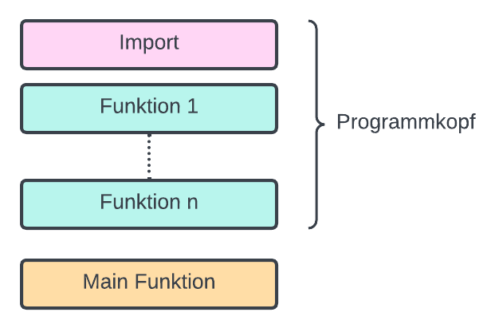

# Funktionen

Je größer deine Programme werden, desto wichtiger wird es die Programme zu strukturieren.
In diesem Kapitel lernst du wie du mit benannten Programmblöcken,
in Python Funktionen genannt, deine Programme strukturieren kannst.
Die Verwendung von Funktionen ist von großer Wichtigkeit, denn du vermeidest dadurch,
dass du gleichen Code mehrmals im Programm hinschreiben musst (Codeduplikation) 
und du kannst damit Probleme in kleinere, leichter zu lösende Teilprobleme zerlegen.

## Beispiel

In den vorhergehenden Kapiteln hast du gelernt, wie die Turtle ein Quadrat zeichnen kann.
Dies ist eine typische, in sich geschlossene Aufgabe und du kannst den dazu benötigten Code in einer Funktion zusammenfassen. 

Die Funktionsdefinition beginnt mit dem Keyword `def`. Dann folgt der Name, eine sogenannte Parameterklammer und ein Doppelpunkt.
Die Anweisungen im Funktionskörper bilden einen Codeblock und sie müssen daher eingerückt sein.

```python
def square():
    repeat 4:
        fd(100)
        rt(90)
```

Im Hauptprogramm rufst du die Funktion mit ihrem Namen auf.
```python
from gturtle import *

def square():
    repeat 4: 
        fd(60) 
        lt(90) 

makeTurtle()

setPenColor("blue")
square()
rt(45)

setPenColor("red")
square()
rt(45)
```

Die Funktion `square` wird also nur einmal definiert und kann dann beliebig oft
aufgerufen werden.


## Strukturierung von Code

Bei der Strukturierung von Code mittels Funktionen spricht man auch vom Prinzip von Teile und Herrsche, wo man versucht, eine grössere Komplexität durch Einteilung in wohldefinierte Teilschritte bzw. Einzelaufgaben zu beherrschen. Wenn man die Teilschritte wieder in Teilschritte einteilt, spricht man auch von schrittweiser Verfeinerung oder dem Top-Down-Programmieren.

Das obere Programm hat bereits eine Funktion, in der professionellen Python Programmierung
ist es aber üblich, das gesamte Hauptprogramm in einer Funktion zu haben.
Man führt dazu eine Funktion namens `main` ein
und ruft die am Ende der eigenen Funktionsdefinition auf.

Die saubere und damit professionellere Variante des Programms sieht also so aus:

```python
from gturtle import *

def square():
    repeat 4: 
        fd(60) 
        lt(90) 

def main():
    makeTurtle()

    setPenColor("blue")
    square()
    rt(45)

    setPenColor("red")
    square()
    rt(45)
    
main()
```

In Zukunft sollten alle deine Programme eine `main` Funktion haben 😉.

## Übungen

### 📝 Übung 26

Definiere eine Funktion sechseck(), mit dem die Turtle ein Sechseck zeichnet. Verwende diese Funktion, um die nebenstehende Figur zu erstellen.
<div style="clear:both;"></div>

### 📝 Übung 27

Definiere eine Funktion für ein Quadrat, das auf der Spitze steht und zeichne damit die nebenstehende Figur.
<div style="clear:both;"></div>

### 📝 Übung 28

Definiere eine Funktion bogen(), mit der die Turtle einen Bogen zeichnet und sich dabei insgesamt um 90 Grad nach rechts dreht. 
<div style="clear:both;"></div>

### 📝 Übung 29

Ergänze das Programm mit der Funktion blumenblatt(), welche zwei Bogen zeichnet. Die Turtle sollte am Ende aber wieder in Startrichtung stehen.	 
<div style="clear:both;"></div>

### 📝 Übung 26

Erweitere das Programm mit der Funktion blume() so, dass eine 8-blättrige Blume entsteht. 
<div style="clear:both;"></div>

## Zusammenfassung

Mit `def bezeichner():` definierst du einen neuen Befehl. Wähle einen Namen,
der die Tätigkeit wiederspiegelt. Alle Anweisungen, die zum neuen Befehl gehören,
müssen eingerückt sein.

```python
def bezeichner():
    Anweisungen
```
Vergiss die Klammern und den Doppelpunkt nach dem Bezeichner nicht!
In Python nennt man neue Befehle auch Funktionen.
Wenn du die Funktion `quadrat()` verwendest,
sagt man auch, die Funktion werde "aufgerufen".

Wir gewöhnen uns daran, die Funktionsdefinitionen
im Programmkopf anzuordnen, da diese vor ihrem Aufruf definiert sein müssen.


