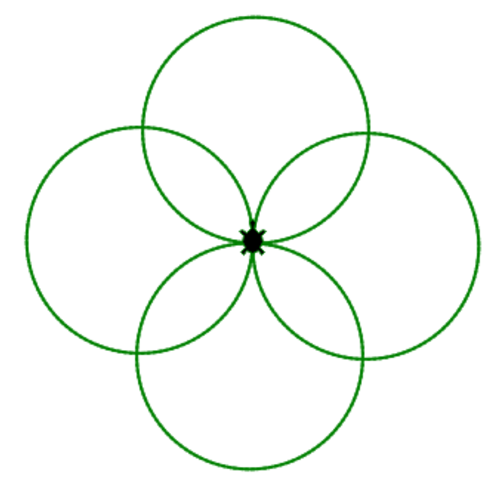
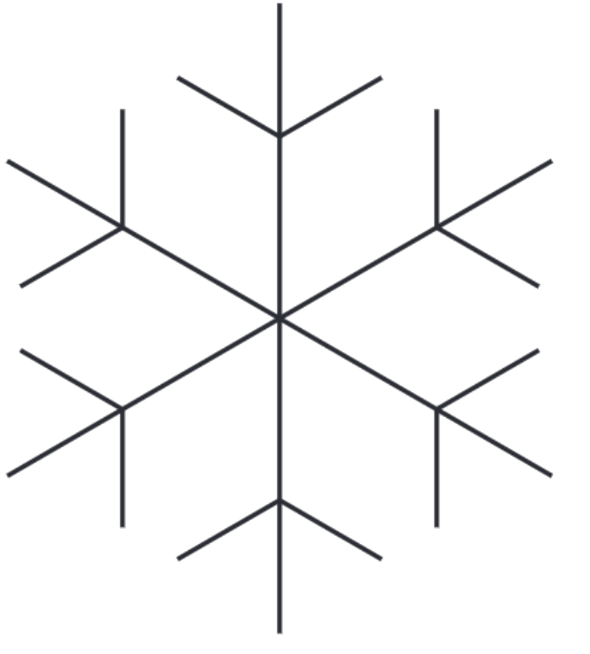
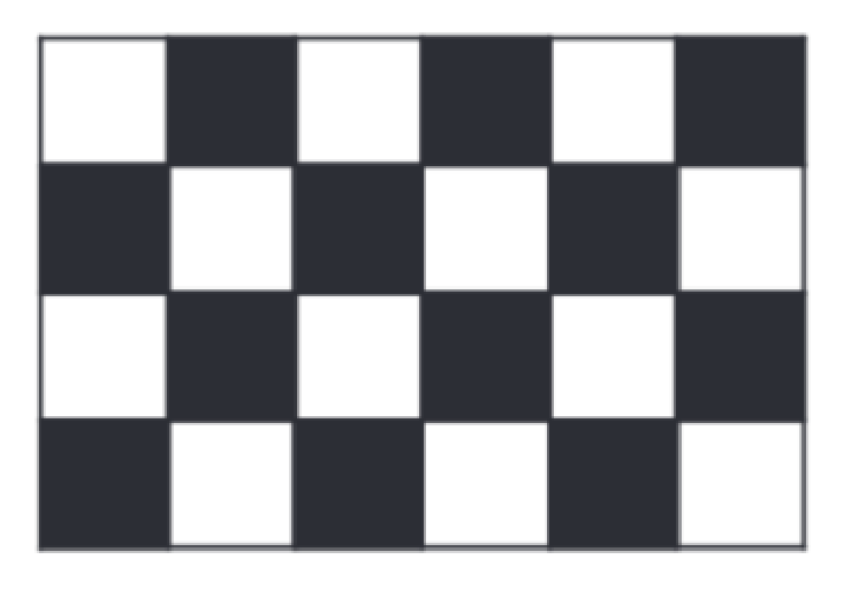

# Kapiteltest 1


<!---

Definiere eine Funktion, die einen Kreis zeichnet. Benutze
die Funktion, um die rechts dargestellte Figur zu zeichnen.
<div style="clear:both;"></div>



Schreibe eine Funktion, welche einen "Ast" der
nebenstehenden Schneeflocke zeichnet.
Schreibe eine weitere Funktion, welche die Funktion
"Ast" sechs mal aufruft, um die gesamte Schneeflocke
zu erhalten.
<div style="clear:both;"></div>



Schreibe eine Funktion `schachbrett`, welche ein Schachbrett zeichnet.
Die Funktion soll zwei Parameter mit den Namen `x` und `y` haben.
Diese beiden Parameter geben die Anzahl der Spalten und die Anzahl der Zeilen an.
Du kannst davon ausgehen, dass sowohl x, als auch y, gerade Zahlen sind.
Das heißt x und y sind ohne Rest durch 2 dividierbar.

**Tipp:** Schreibe eine Funktion welche ein Mini-Schachbrett mit
der Größe 2x2 zeichnet und und wiederhole dieses x/2 mal in x-Richtung
und y/2 mal in y-Richtung.

<div style="clear:both;"></div>	
-->
## Aufgabe 1: Trinkwasserbedarf
Schreibe  ein Programm, bei dem der Benutzer Folgendes eingeben kann:

* Die Anzahl der Personen.
* Den täglichen Trinkwasserbedarf pro Person in Litern.
* Die Anzahl der Tage, für die der Bedarf berechnet werden soll.

Das Programm soll dann die Gesamtmenge an Trinkwasser berechnen, die für die angegebene Anzahl an Personen über die vorgegebene Zeitspanne benötigt wird.

```
⌨️Input: Geben Sie die Anzahl der Personen ein: 4  
⌨️Input: Geben Sie den täglichen Trinkwasserbedarf pro Person in Litern ein: 2.5  
⌨️Input: Geben Sie die Anzahl der Tage ein: 7  
🖨️Print: Die benötigte Trinkwassermenge beträgt 70 Liter.
```


## Aufgabe 2: Berechnen der Fahrtdauer
Schreibe ein Programm, bei dem du Folgendes eingeben kannst:

* Die Distanz der zu fahrenden Strecke in Kilometern.
* Die durchschnittliche Reisegeschwindigkeit in Kilometern pro Stunde.

Das Programm soll die Fahrtdauer in Stunden berechnen und ausgeben.

```
⌨️Input: Gib die Distanz der Strecke in Kilometern ein: 150  
⌨️Input: Gib die durchschnittliche Reisegeschwindigkeit in km/h ein: 75  
🖨️Print: Die Fahrtdauer beträgt 2 Stunden.
```


## Aufgabe 3: Umrechnung in Sekunden
Schreibe ein Programm, bei dem der Benutzer eine Zeitspanne in Sekunden eingeben kann.
Das Programm soll diese Zeitspanne in Stunden, Minuten und Sekunden umrechnen und die Ergebnisse ausgeben.

**Tipp:** Es gibt 3600 Sekunden in einer Stunde und 60 Sekunden in einer Minute.

```
⌨️Input: Geben Sie die Zeitspanne in Sekunden ein: 7384  
🖨️Print: Das sind 2 Stunden, 3 Minuten und 4 Sekunden.
```

## Aufgabe 4: Raumvolumenberechnung

Schreiben Sie ein Programm, bei dem der Benutzer die Länge, Breite und Höhe eines Raumes in Metern eingeben kann. Das Programm soll dann:

* Das Volumen des Raumes in Kubikmetern berechnen.
* Die Fläche der vier Wände berechnen, wenn der Raum als Quader betrachtet wird.

**Beispiel**:
```
⌨️Input: Geben Sie die Länge des Raumes ein: 5  
⌨️Input: Geben Sie die Breite des Raumes ein: 4  
⌨️Input: Geben Sie die Höhe des Raumes ein: 3  
🖨️Print: Das Volumen des Raumes beträgt 60 Kubikmeter.  
🖨️Print: Die Fläche der Wände beträgt 54 Quadratmeter.
```

## Aufgabe 5: Stromkostenberechnung

Schreiben Sie ein Programm, bei dem der Benutzer Folgendes eingeben kann:

* Die Leistung eines Elektrogeräts in Watt.
* Die Betriebsdauer des Geräts in Stunden pro Tag.
* Die Anzahl der Tage, an denen das Gerät benutzt wird.
* Den Strompreis in Cent pro Kilowattstunde.

Das Programm soll dann die Gesamtkosten für den Betrieb des Geräts über die angegebene Zeit berechnen.

**Tipps:**
* 1 Kilowattstunde (kWh) entspricht 1000 Watt für eine Stunde.
* Die Kosten in Cent sind die Leistung in kWh multipliziert mit der Anzahl der Betriebsstunden und dem Preis pro kWh.

```
⌨️Input: Geben Sie die Leistung des Geräts in Watt ein: 1000  
⌨️Input: Geben Sie die Betriebsdauer in Stunden pro Tag ein: 3  
⌨️Input: Geben Sie die Anzahl der Tage ein: 10  
⌨️Input: Geben Sie den Strompreis in Cent pro kWh ein: 30  
🖨️Print: Die Gesamtkosten betragen 900 Cent.
```

## Aufgabe 6: Landungsberechnung auf dem Mond

Schreiben Sie ein Programm, das den Benutzer Folgendes eingeben lässt:

* Die Masse eines Objekts auf der Erde in Kilogramm.
* Die Masse eines anderen Objekts auf der Erde in Kilogramm.

Das Programm soll dann die Gewichtskraft dieser Objekte auf dem Mond berechnen und ausgeben.

Hinweis: Die Gravitationskraft auf dem Mond beträgt etwa 1/6 der Gravitationskraft auf der Erde. Gewichtskraft ***F<sub>M</sub>*** auf dem Mond für eine Masse mm berechnet sich wie folgt:
$$F_M=m×\frac{9.81}{6}$$


```
⌨️Input: Geben Sie die Masse des ersten Objekts in kg ein: 70  
⌨️Input: Geben Sie die Masse des zweiten Objekts in kg ein: 50  
🖨️Print: Die Gewichtskraft des ersten Objekts auf dem Mond beträgt 114.45 N.  
🖨️Print: Die Gewichtskraft des zweiten Objekts auf dem Mond beträgt 81.75 N.
```


<!---
## Aufgabe 7	
Schreiben Sie ein Programm, bei dem der Benutzer die Anzahl
der zu zeichnenden Quadrate eingeben kann.
Gibt der Benutzer beispielsweise 5 ein,
so werden fünf Quadrate nebeneinander gezeichnet

## Aufgabe 8
Schreiben Sie ein Programm, bei dem der Benutzer die Anzahl der
Ecken eines regelmäßigen Vielecks angibt. Gibt
der Benutzer beispielsweise 8 ein, so soll ein regelmäßiges Achteck gezeichnet werden.

## Aufgabe 9
Schreiben Sie ein Programm, bei dem der Benutzer die Anzahl der
Blütenblätter einer Blume eingeben kann. Falls
der Benutzer 20 eingibt, wird eine Blume mit 20 Blütenblättern gezeichnet.

## Aufgabe 10
Schreiben Sie ein Programm, bei dem der Benutzer die Anzahl
der Blütenblätter und die Anzahl der Blumen eingeben kann.
Falls er beispielsweise 20 und 6 eingibt, werden sechs Blumen mit zwanzig Blütenblättern
nebeneinander gezeichnet.

-->


