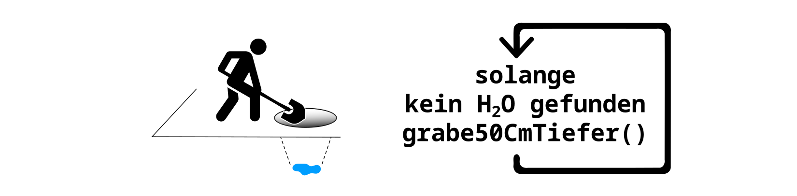
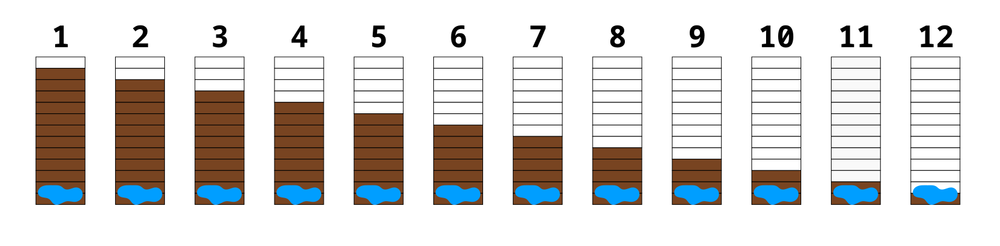

# Verzweigungen 🌱 und Schleifen 🔁

In diesem Kapitel sehen wir uns zwei wichtigte Konzepte
der Programmierung an: **Verzweigungen** und **Schleifen**.

## Verzweigungen

Im Alltag triffst du ständig Entscheidungen, die von bestimmten **Bedingungen** abhängen. Zum Beispiel entscheidest du je nach Wetter, wie du zur Schule fährst: "**Falls** es regnet, nimmst du die Bim; ansonsten fährst du mit dem Fahrrad."

Auch in der Programmierung können Anweisungen von bestimmten Bedingungen abhängen.
Solche **Verzweigungen** ermöglichen es einem Programm, je nach Situation unterschiedliche Anweisungen auszuführen. Sie zählen zu den Grundbausteinen jeder Programmiersprache und sorgen dafür, dass Programme flexibel auf verschiedene Bedingungen reagieren können.

## Schleifen

Im Alltag gibt es viele Situationen, in denen wir Dinge mehrmals hintereinander machen müssen.
Stell dir vor, du möchtest einen Brunnen graben und du hast die Funktion `grabe50CmTiefer()`,
wenn du diese aufrufst, dann gräbst du 50 Zentimeter weiter nach unten.
Um einen Brunnen zu graben musst du die Anweisung **grabe50CmTiefer** ausführen,
**solange** du noch kein Wasser gefunden hast.
Bei der Schleife, gibt es wie bei der Verzweigung, eine **Bedingung**.
In diesem Beispiel ist die Bedingung **"Noch kein Wasser gefunden"**.
Während diese Bedingung gilt, führst du die Anweisung aus, also gräbst du weiter.

Nehmen wir an der Grundwasserspiegel ist 5 Meter und 70 Zentimeter unterhalb der
Erdoberfläche. Wenn du die oben bildlich dargestellte Schleife ausführst,
dann erreichst du das Grundwasser nach **12 Schleifendurchläufen**.

In der Programmierung funktioniert das ähnlich: Mit einer **Schleife** kannst du dafür sorgen, dass bestimmte Anweisungen mehrmals wiederholt werden,
ohne dass du jeden Schritt einzeln aufschreiben musst.
Stattdessen gibst du nur an, wie oft oder wie lange der Ablauf wiederholt werden soll.
Schleifen gehören zu den Grundstrukturen jeder Programmiersprache und helfen dabei, Programme kürzer und einfacher zu gestalten.

