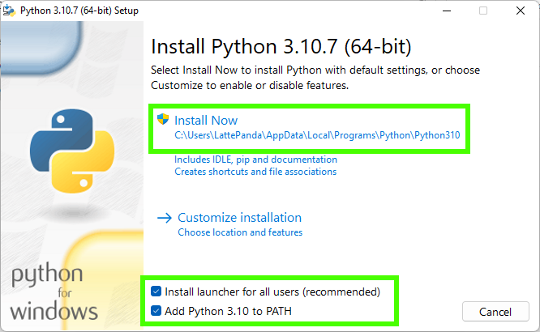
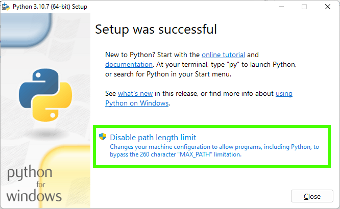
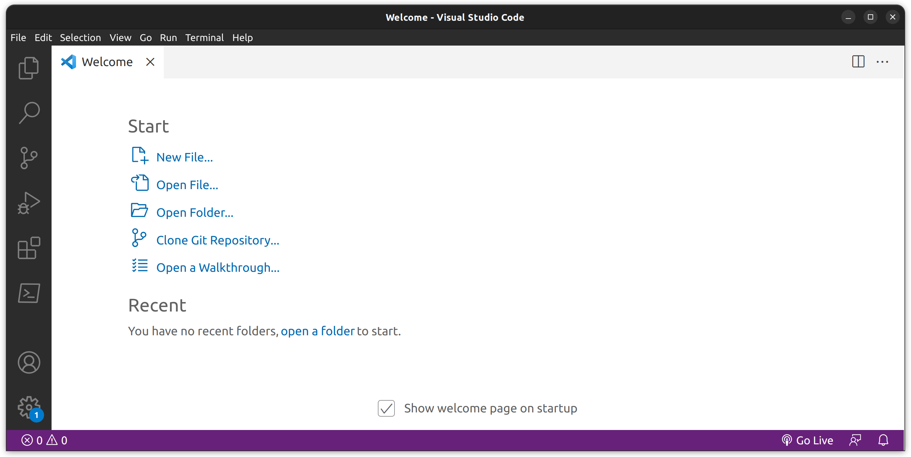

# von VS Code und Python

Die Umgebung WebTigerJython ist eine Cloud-Applikation,
welche keine Installation benötigt.
Sie lässt sich gleich im Browser aufrufen.
Üblicherweise werden Entwicklungsumgebungen jedoch 
direkt auf dem Rechner des Entwicklers installiert.

In diesem Kapitel sehen wir uns Schritt für Schritt an,
wie man Visual Studio Code, in der Folge VS Code genannt,
und Python installiert.

**Tipp:** Falls du während der Installation gefragt wirst,
ob du die deutsche oder die englische Version installieren möchtest,
so empfehle ich dir die englische zu nehmen.
Auf diese Weise lernst du gleich viele Fachbegriffe.

## Installation von VS Code

Navigiere im Webbrowser zur Website https://code.visualstudio.com/Download. 
Wähle auf der Seite die richtige Version für dein Betriebssystem,
lade das Paket runter und
installiere das Programm nach den Anweisungen am Bildschirm.


## Installation von Python

Navigiere im Webbrowser zur Website https://www.python.org/downloads/.
Wähle wieder die richtige Version für dein Betriebssystem, lade das Paket herunter
und installiere es.

**Wichtig:** Dieses mal gibt es aber bei der Installation etwas zu beachten.
Aktiviere auf jeden Fall die Checkboxen um Python:

+ für alle Benutzer zu installieren
+ Python zum PATH (Suchpfad) hinzuzufügen



Am Ende der Installation wird abgefragt, ob die Beschränkung für
Dateipfadlängen aufgehoben werden soll.
Klicke hier auf den Button mit dem Schutzschild und deaktiviere damit die Beschränkung.



## Installieren der Python Extension für VS Code

Wenn du sowohl VS Code als auch Python installiert hast,
kannst du VS Code starten.
Python starten wir nicht direkt, sondern von VS Code aus.
Dazu müssen wir aber zuerst eine Erweiterung (engl. Extension) installieren.

Wenn du VS Code startest, sollte es wie folgt aussehen:



Um die Python Extension zu installieren klicke links auf das Symbol Extensions (1),
dann gibt in der Suchleiste (2) "Python" ein und klicke dann auf "Installieren" (3).


## Testen der Umgebung

Zum Testen der Umgebung lege einen neuen Ordner in einem beliebigen Verzeichnis an.
Dieser Ordner wird unser Arbeitsordner sein.
In diesem werden unsere Python Programme liegen.

Wenn du den Ordner angelegt hast, klicke im VS Code auf "File" (Datei)
und dann auf "Open Folder" (Ordner öffnen) und wähle den gerade erstellten Ordner an.


Wähle dann unter "File" (Datei) den Menüpunkt "New File" (Neue Datei) und 
nenne die neue Datei "ersterVersuch.py".

Tippe das kleine Testprogramm ein, speichere es mit dem Menüpunkt "File" und "Save"
(oder mit der Tastenkombination `STRG + S`).

```python
print("Hello World")
x = 5 * 4
print(x)
```

Du kannst das Programm mit dem "Run" Button (1) starten.
Die Ausgabe erscheint im so genannten Terminal-Fenster (2).


Falls das Testprogramm funktioniert hat, hast du deine Umgebung
korrekt aufgesetzt. Gratulation!

Falls es nicht funktioniert hat, bekommst du üblicherweise eine Fehlermeldung.
Das Beste ist die Fehlermeldung in https://www.google.com einzugeben
und nach einer Lösung zu suchen.
Die Chance, dass du der einzige mit einem gewissen Problem bist,
ist sehr gering, weshalb du fast immer Hilfestellungen im Internet findest.

Falls auch das nicht weiterhilft, dann darfst du gerne deinen Lehrer fragen. 😉


