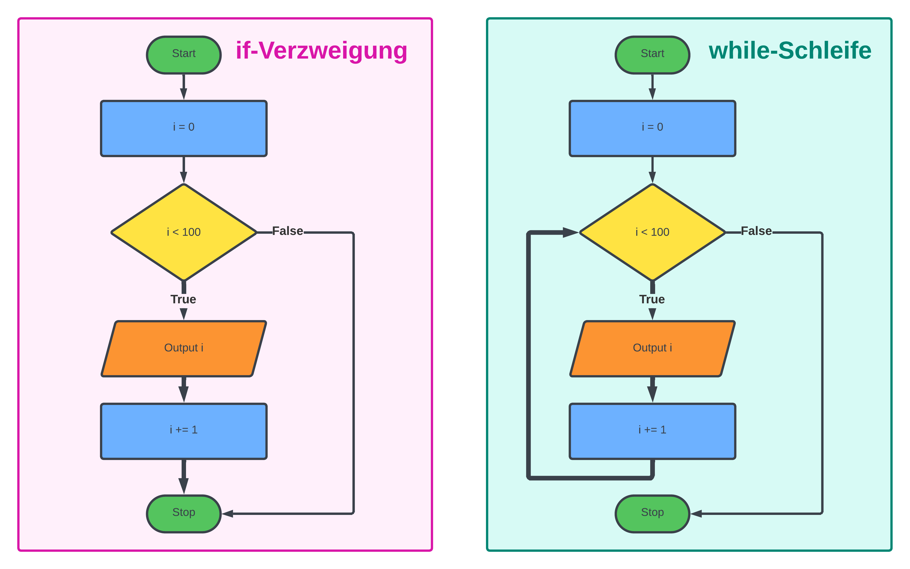

# Wiederholungen mit while-Schleifen

Mit Schleifen können wir bestimmte Codeblöcke mehrfach wiederholen.

Ein Beispiel ist eine Passwortabfrage:
Wir möchten den Benutzer so lange nach dem Passwort fragen, bis er es richtig eingibt.

Immer wenn wir einen Codeblock wiederholen möchten, 
**solange** eine bestimmte Bedingung erfüllt ist, verwenden wir die `while`-Schleife.

## 💡 Beispiel: Eingabe einer Geheimzahl

Nehmen wir an wir möchten ein Programm schreiben,
bei dem der Benutzer beliebig oft eine Zahl eingeben kann,
bis er die Geheimzahl erraten hat.

Zuerst brauchen wir die sogenannte **Schleifenbedingung**.
Solange diese Bedingung gilt, wird die Schleife wiederholt.
Nehmen wir an unsere Geheimzahl ist 13, dann wäre die Bedingung: `!(eingabe == 13)`
oder in Kurzschreibweise: `(eingabe != 13)`.


```cs
int eingabe = 0;

while (eingabe != 13)
{
    eingabe = Turtle.InputInt("Rate die Geheimzahl: "))
}

Turtle.Print("Du hast die Geheimzahl erraten")
```

Die `while`-Schleife wird mit dem Schlüsselwort **while** eingeleitet, gefolgt von einer Schleifenbedingung.
Die Anweisungen im Codeblock werden wiederholt, **solange** die Bedingung erfüllt ist.
Nach Ende der Wiederholungen wird das Programm mit der nächsten Anweisung nach dem Codeblock fortgesetzt.

**⚠️ Vorsicht:** Achte darauf, dass die Bedingung in **runden Klammern** steht. Die Anweisungen, die wiederholt werden, wenn die Bedingung zutrifft, schreibst du in **geschweifte Klammern**.

## "Bis"-Bedingungen in "While"-Bedingungen umwandeln

Die Angabe einer **while**-Bedingung ist für uns am Anfang etwas unnatürlich.
Beim obigen beispiel würde man natürlichsprachlich sagen:
"Die Schleife muss wiederholt werden **bis** der Benutzer die Geheimzahl richtig hat.
Wir möchten also die Schleife ausführen, bis `(eingabe == 13)` gilt.

Die `while`-Schleife verlangt aber nach **solange**-Bedingungen.
Deshalb müssen wir die natürlichsprachliche **bis**-Bedingung in eine **solange**-Bedingung umwandeln.
Das können wir, indem wir den Wahrheitswert der "Bis"-Bedingung
mit einem **logischen Nicht** umdrehen.

Die Aussage:
* Wiederhole die Schleife **bis** `(eingabe == 13)` ist dasselbe wie
* Wiederhole die Schleife **solange** `(eingabe != 13)`

Hier sind noch weitere Beispiele:

| Bis-Bedingung  | ✅ while-Bedingung | C# Code |
| ------------- | ------------- | ------------- |
| Ich spare **bis** ich **1000€ oder mehr** habe | Ich spare **solange** ich **weniger als 1000€** habe | `while (geld < 1000) { sparen(); }` |
| Ich beschleunige **bis** ich **60 km/h** habe | Ich beschleunige **solange** ich  **weniger als 60 km/h** habe |  `while (speed < 60) { beschleunigen(); }` |
| Ich besuche die Schule **bis** ich die Matura **habe** | Ich besuche die Schule **solange** ich die Matura **nicht habe** | `while (!matura) { schuleBesuchen(); }` |
| Ich trainiere bis ich die 100 Meter unter 11 Sekunden laufe | Solange ich für 100 Meter mehr als 11 Sekunden brauche trainiere ich | `while (time >= 11) { trainiere(); }` |


## 💡 Beispiel: Mit while-Schleife zählen

Wir wollen nun die while schleife benutzen, um eine
Variable so lange um 1 zu erhöhen, solange sie kleiner als 100 ist.
Nehmen wir an die Variable heißt `i`, dann lautet die Schleifenbedingung `i < 100`.

```cs
int i = 0;

while (i < 100)
{
    Turtle.Print(i);
    i = i + 1;
}
```

Diese Schleife wird 100 Mal wiederholt, da zur Zahl `0` solange `1` dazu addiert wird,
solange die Zahl kleiner 100 ist. In diesem Beispiel haben wir also
das Verhalten einer `for`-Schleife mit einer `while`-Schleife nach programmiert.

## Ähnlichkeit zur Verzweigung

Die `while`-Schleife hat eine gewisse Ähnlichkeit zur `if`-Verzweigung.

* Die `if`-Verzweigung wird **einmal** ausgeführt, **falls** die Bedingung erfüllt ist
* Die `while`-Schleife wird **solange** ausgeführt, **solange** die Bedingung erfüllt ist

Sehen wir uns die beiden folgenden Programme an.

Die beiden Programme sind, bis auf die Schlüsselwörter `if` und `while`, gleich.
Der erste Programm überprüft mit der `if`-Verzweigung ob die Bedingung 
`i < 100` gilt, wenn ja werden die zwei Zeilen im Codeblock **einmal** ausgeführt.

```python
i = 0

if (i < 100):
    print(i)
    i += 1
```

Das zweite Programm enthält eine `while`-Schleife.
Diese prüft ebenfalls,  ob die Bedingung `i < 100` gilt.
Der Unterschied ist aber, dass der Codeblock **solange** ausgeführt wird,
solange die Bedingung gilt. Der Codeblock in der Schleife
wird also in diesem Fall **100 Mal** ausgeführt.

```python
i = 0

while (i < 100):
    print(i)
    i += 1
```

## Flussdiagramm der while-Schleife

Den Unterschied kannst du auch im Flussdiagramm klar erkennen.
Die unterschiedlichen Pfeile sind fett hervorgehoben.



## ⚠️ Die Endlosschleife und Abbruch mit break


## Übungen

### 📝 Übung 35
Schreibe ein Programm bei dem der Benutzer eine Zahl eingeben kann.
Das Programm soll die Zahl solange verdoppeln,
solange die Zahl kleiner als 100 ist.

**Beispiel: **
```
Geben Sie eine Zahl ein: 5
Ausgabe:
5
10
20
40
80
```

### 📝 Übung 36
Schreibe ein Programm, bei dem der Benutzer so lange eine Zahl eingeben muss,
bis er eine Zahl eingibt die größer als 1000 ist.

**⚠️ Vorsicht:** In diesem Beispiel wurde die Schleifenbedingung mit dem
Wort **bis** angegeben. Das Wort **bis** ist aber genau das Gegenteil von **solange**.

Wenn du eine Schleife wiederholen möchtest, **bis die Zahl größer als 1000** ist,
so das äquivalent zu: **solange die Zahl kleiner oder gleich 1000** ist.

Du brauchst also eine Schleife in der Form: `while (zahl <= 1000)`

### 📝 Übung 37
Schreibe ein Programm, bei dem der Benutzer solange eine Zahl
eingeben muss, bis die Summe aller bis dahin eingegeben Zahlen
den Wert 1000 übersteigt.

### 📝 Übung 38

Schreibe ein Programm, beim der Benutzer eine positive Zahl eingeben kann. Falls die Zahl
negativ ist, soll die Eingabe *solange* wiederholt werden, bis die Zahl positiv ist.
Das Programm soll dann in einer `for`-Schleife alle Teiler der
eingegeben Zahl ermitteln und ausgeben.

**Beispiel:**

* Eingabe: 24
* Ausgabe: 1, 2, 3, 4, 6, 8, 12

### 📝 Übung 39

Schreibe ein Programm bei der Zuerst eine Zufallszahl zwischen 1 und 100 generiert wird.
Der folgende Code demonstriert wie das funktioniert.

```python
from random import *
randint(1,100)
```
Der Benutzer muss solange eine Zahl eingeben, bis er die Zufallszahl errät.
Falls der Benutzer eine zu kleine Zahl eingibt, gibst du "zu niedrig" aus.
Falls die Eingabe zu hoch ist, gibst du "zu hoch" aus.
So unterstützt du den Benutzer deines Programms.

## 🧭 Zusammenfassung


