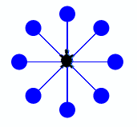

# n-Faches Wiederholen mit for-Schleifen

Häufig haben wir beim Programmieren die Situation,
dass wir einen gewissen Codeblock, also eine Folge von Anweisungen,
genau **n-Mal** ausführen möchten.

Das ist beispielsweise beim zeichnen eines Quadrats so:

```cs
#r "nuget: BulmeSharp, 0.10.1"
using BulmeSharp;

Turtle.fd(50);
Turtle.rt(90);
Turtle.fd(50);
Turtle.rt(90);
Turtle.fd(50);
Turtle.rt(90);
Turtle.fd(50);
Turtle.rt(90);

Turtle.showTurtle();
```

Die beiden Zeilen `Turtle.fd(50);` und `Turtle.rt(90);` werden hier viermal wiederholt.
Das ist umständlich und auch gar nicht nötig, denn wir können
C# anweisen, die zwei Zeilen einfach viermal auszuführen.

Bis jetzt haben wir hierfür die while-Schleife kennengelernt.
Wie könnten das Quadrat beispielsweise mit folgendem Code zeichnen:

```cs
int i = 0;

while (i < 4)
{
    Turtle.fd(50);
    Turtle.rt(90);
    i++;
}
Turtle.showTurtle();
```

Diese Schleifenart nennt man auch Zählschleife.
Da sie oft verwendet wird, gibt es dafür ein eigenes Konstrukt:
die **for**-Schleife. In diesem Kapitel lernst du die for-Schleife kennen,
mit der du Codeblöcke eine festgelegte Anzahl von Malen wiederholen kannst.

## Die for-Schleife

Möchten wir einen Codeblock n-Mal ausführen so verwenden wir die for-Schleife.
Möchten wir die beiden Zeilen aus dem vorhergegangen
Beispiel **vier**mal wiederholen, so schreiben wir:

```cs
#r "nuget: BulmeSharp, 0.10.1"
using BulmeSharp;

for (int i = 0; i < 4; i++)
{
    Turtle.fd(50);
    Turtle.rt(90);
}

Turtle.showTurtle();
```

Die Variable `i` ist die Zählvariable, die mitzählt bei welcher Wiederholung wir sind.

**⚠️ Vorsicht:** die Zählvariable beginnt bei `0` zu zählen,
wie überall in der Informatik üblich.
Deshalb zählt sie bei vier Wiederholungen von 0 bis 3.

## 📜 Syntax

Die for-Schleife hat von allen bis jetzt bekannten Konstrukten,
die komplizierteste Syntax:

```cs
for (<Initialisierung>, <Bedingung>, <operation>)
{
    Anweisungen, die
    solange die bedingung gilt
}
```

Die drei mit Beistrich getrennten Teile sind:

* **Initialisierung**: Hier wird die Zählvariable definiert und ein Startwert vergeben. Meistens verwendet man die Kleinbuchstaben `i`, `j` und `k` für die Zählvariable. Der Initialisierungsteil könnte beispielsweise lauten: `int i = 0`
* **Bedingung**: Die von der While-Schleife bekannte Bedingung. Auch die for-Schleife hat eine solange-Bedingung. Falls eine Schleife bis inkl. `10` zählen soll, so muss die Bedingung `i <= 10` sein.
* **Operation**: Die Veränderung der Zählvariable. Meistens wird die Zählvariable entweder inkrementiert, dekrementiert oder es wird bei jedem Durchlauf ein fixer Wert hinzuaddiert. Beispiele sind: `i++`, `i--`, `i += 4` oder `i *= 2`


Damit definiert ist, welche Anweisungen den zu wiederholenden Codeblock bilden,
müssen die zu wiederholenden Anweisungen in geschweifte Klammern geschrieben werden.


## Beispiel
Um ein regelmäßiges Neuneck zu zeichnen muss
die Turtle neunmal geradeaus gehen und sich dann um 40° drehen.
Würdest du das alles untereinander schreiben, dann würde das Programm ziemlich lange werden.
Hier verwenden wir in Zeile 4 aber die
for-Schleife und sagen der Turtle damit, sie soll die zwei eingerückten
Funktionsaufrufe in Zeilen 5 und 6 neunmal wiederholen.

```cs
#r "nuget: BulmeSharp, 0.10.1"
using BulmeSharp;

for (int i = 0; i < 9; i++)
{
    Turtle.fd(50);
    Turtle.rt(40);
}

Turtle.showTurtle();
```


## Übungen

### 📝 Übung 40

Zeichne die nebenstehende Figur. Dazu brauchst du auch die Funktionen bk() und dot().
<div style="clear:both;"></div>

### 📝 Übung 41

Zeichne eine Perlenkette, die aus 18 Perlen (dots) besteht. Zwischen den Perlen muss die Turtle jeweils einige Schritte vorwärts gehen und um einen kleinen Winkel (z.B. 20°) nach links drehen.
<div style="clear:both;"></div>

### 📝 Übung 42

Zeichne die Treppenfigur in der nebenstehenden Abbildung.
Verwende dazu die for-Schleife.
<div style="clear:both;"></div>

### 📝 Übung 43

Zeichne das Pentagramm in der nebenstehenden Abbildung.
Überlege dir zuerst, wie die Drehwinkel lauten
und verwende wieder die for-Schleife um die Figur zu zeichnen.
<div style="clear:both;"></div>

### 📝 Übung 44

Zeichne den Stern in der nebenstehenden Abbildung.
Überlege dir zuerst, welche Teile wiederholt werden 
und verwende wieder die for-Schleife um die Figur zu zeichnen.
<div style="clear:both;"></div>

### 📝 Übung 45
Schreibe ein Programm, bei dem der Benutzer eine Ganzzahl eingeben kann.
Gibt der Benutzer die Zahl 3 ein, so wird ein regelmäßiges Dreieck gezeichnet.
Gibt der Benutzer die Zahl 4 ein, so wird ein regelmäßiges Viereck gezeichnet,
und so weiter.

### 📝 Übung 46

Schreibe ein Programm, beim der Benutzer eine positive Zahl eingeben muss. Das Programm
soll dann in einer for-Schleife alle Teiler der eingegeben Zahl ermitteln und ausgeben.

**Beispiel:** 

* Eingabe: 24
* Ausgabe: 1, 2, 3, 4, 6, 8, 12

### 📝 Übung 47
Schreibe ein Programm, welches die Quadrate aller Zahlen von 1 bis 20 ausgibt.

**Ausgabe:** 1, 4, 9, 16, ...., 361, 400

## 🧭 Zusammenfassung
Mit `for i in range(anzahl):` gibst du der Turtle
an, sie soll einen oder mehrere Anweisungen `anzahl`-mal wiederholen,
bevor sie mit neuen Anweisungen weitermacht.
Alles, was wiederholt werden soll, muss unter repeat stehen und eingerückt sein.

```cs
for (int i = 0; i < n; i++)
{
    Anweisungen die n-Mal
    wiederholt werden sollen
}
```


