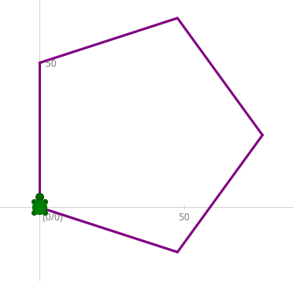
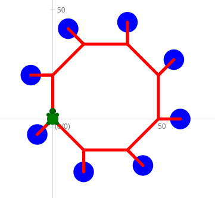
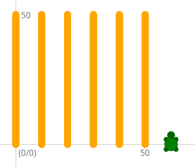
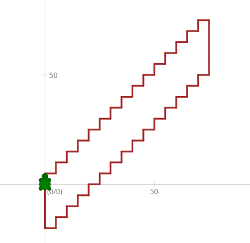
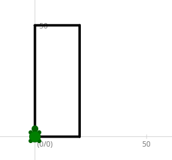
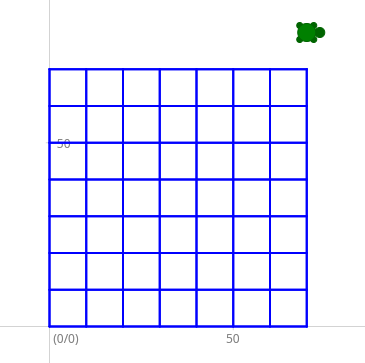
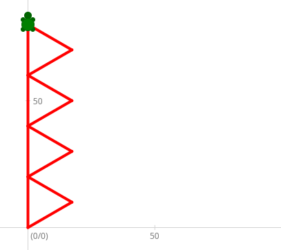

# Kapiteltest 2B - while- und for-Schleifen 

## Aufgabe 1: Pentagon


Zeichne ein Pentagon (Fünfeck) in violetter Farbe und Strichstärke 3.
Benutze dazu die for-Schleife oder die while-Schleife
<div style="clear:both;"></div>

## Aufgabe 2: Rotes Achteck


Zeichne das dargestellte Achteck in roter Farbe und Strichstärke 5.
Benutze dazu die for-Schleife oder die while-Schleife.

**Tipp:** Ändere die Farbe auf blau, bevor du den Dot zeichnest und wechsle die Farbe 
danach wieder auf rot

<div style="clear:both;"></div>

## Aufgabe 3: Vertikale Linien


Zeichne die dargestellten vertikalen Linien in der Strichstärke 10 mit der Farbe Orange.

Benutze dazu die for-Schleife oder die while-Schleife.

**Tipp:** Zwischen den Linien musst du mit penUp() und penDown() den Stift heben, bzw. wieder senken.

**Zusatz:** Schaffst du es, dass der Benutzer sowohl die Länge,
als auch die Anzahl der Vertikalen Linien eingeben kann?

<div style="clear:both;"></div>


## Aufgabe 4: Treppen


Zeichne die dargestellte braune Treppe mit 15 Stufen.

Benutze dazu die for-Schleife oder die while-Schleife.

**Tipp:** Du wirst zwei Schleifen brauchen. Eine Schleife um die Treppe nach oben zu gehen.
Dann musst du ein Stück zurückfahren und dann eine zweite Schleife um die Treppe nach unten zu gehen.

<div style="clear:both;"></div>

## Aufgabe 5: Rechteck mit Benutzereingabe für Seitenlängen


Schreibe ein Programm, bei dem der Benutzer die beiden Seitenlängen für ein Rechteck
eingeben kann. Das Programm soll das Rechteck in der eingegebenen Größe zeichnen.

Gib am Ende noch den Flächeninhalt und den Umfang des Rechtecks aus.

**Tipp:** Damit der Benutzer angeben kann wie weit die Turtle fährt,
musst du den Wert, den der Benutzer eingibt, bei `Turtle.fd` als
Argument angeben. So wie in diesem Beispiel:

```cs
double seite_a = Turtle.InputDouble("Seite a eingeben");
Turtle.fd(seite_a);
```

<div style="clear:both;"></div>

## Aufgabe 6: Gittermuster


Schreibe ein Programm, welches ein Gitter mit 8x8 Stäben zeichnet.
Der Benutzer soll angeben wie weit die Stäbe auseinander sind.


**Tipp:** Die Länge der Stäbe kannst du mit der Formel:
(Abstand der Stäbe) * 7 berechnen.

**Zusatz:** Schaffst du es, dass der Benutzer auch die Anzahl der Stäbe angeben kann?

<div style="clear:both;"></div>

## Aufgabe 7: Dreiecke


Schreibe ein Programm, bei dem der Benutzer eingeben kann wie
viele gleichseitige Dreiecke er haben möchte.
Zusätzlich kann der Benutzer noch die Größe der Dreiecke angeben.

Berechne den Gesamtumfang der Dreiecke und gib ihn aus.
Die Formel lautet: Anzahl der Dreiecke * Seitenlänge * 3

**Zusatz:** Schaffst du es, dass zwischen den Dreiecken ein kleiner Abstand ist?

<div style="clear:both;"></div>
