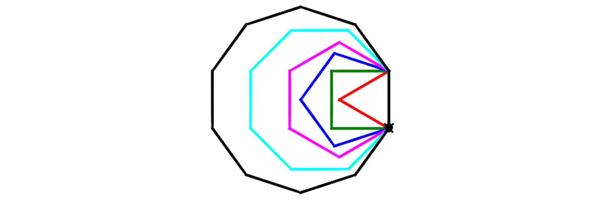

# Funktionen mit Parametern

In diesem Kapitel lernst du wie du Funktionen mit **Parametern** definieren kannst.
Du kennst Parameter bereits von vielen Turtlefunktionen.
Bei der Funktion `fd(s)` darfst du für `s` verschiedene Ausdrücke einsetzen.
Mit `fd(100)` bewegt sich Turtle 100 Pixel vorwärts.
Die Funktion `fd(s)` hat einen Paramter `s`.
Auch selbst definierte Funktionen können Parameter haben.

Die Parametrisierung von Funktionen ist von großer Wichtigkeit,
denn damit erhalten die Funktionen erst die
Flexibilität, sich "angepasst" zu verhalten.

## Beispiel mit einem Parameter

Im vorherigen Kapitel hast du eine Funktion `square()` definiert, die ein Quadrat mit fixer Seitenlänge 60 zeichnet. Man sagt anschaulich, dass die Seitenlänge 60 im Programm "fest verdrahtet" oder "hard coded" sei.

Die Funktion kann viel flexibler eingesetzt werden, wenn du die Seitenlänge beim Funktionsaufruf angeben kannst, also z.B. `square(50)` oder `square(70)` schreiben kannst.
Dazu musst du die Funktionsdefinition von `square(s)` mit einem Parameter versehen, dessen Name du in die Parameterklammer schreibst. 

Den Parameter kannst du im Innern der Funktion (im Funktionskörper) wie eine gewöhnliche Variable verwenden. Im Programm zeichnet die Turtle zwei Quadrate mit den Seitenlängen 80 und 50.

```python
from gturtle import *

def square(s):    
    repeat 4: 
        fd(s) 
        lt(90)

def main():
    makeTurtle()
    setPenColor("red")
    square(80)
    lt(180)
    setPenColor("green")
    square(50)

main()
```

## Beispiel mit mehreren Parametern

Eine Funktion kann auch mehrere Parameter haben.
Die einzelnen Parameter müssen dann mit einem Beistrich getrennt werden.
In deinem Beispiel definierst du eine Funktion `polygon(n, c)` mit zwei Parametern: 
`n` für die Anzahl Ecken, `c` für die Stiftfarbe.
Die Funktion zeichnet regelmässige Vielecke mit der gegebenen Anzahl Ecken und Farbe.
Im Hauptprogramm wird die Funktion 6 mal aufgerufen
und zeichnet dabei ein Dreieck, Quadrat, 5-Eck, 6-Eck,
8-Eck und 10 Eck und in verschiedenen Farben.

Der Drehwinkel, den du zum Zeichnen benötigst, lässt sich mit 360 / n berechnen.

```python
from gturtle import *

def polygon(n, c):
    w = 360 / n
    setPenColor(c)
    for i in range(n):
        fd(100)
        lt(w)

def main():
    makeTurtle()

    polygon(3, "red")
    polygon(4, "green")
    polygon(5, "blue")
    polygon(6, "magenta")
    polygon(8, "cyan")
    polygon(10, "black")

main()
```




## Übungen

### 📝 Übung 56

Schreibe zuerst eine Funktion `square(s)`, welche ein Quadrat mit der 
Seitenlänge s zeichnet. 
Die Turtle soll 10 Quadrate zeichnen. Die Seitenlänge des ersten Quadrats ist 8. Bei jedem nächsten Quadrat ist die Seitenlänge um 10 grösser. 
<div style="clear:both;"></div>


### 📝 Übung 57

Schreibe zuerst eine Funktion `square(s)`, welche ein Quadrat mit der 
Seitenlänge s zeichnet. 
Du kannst in einer Dialogbox die Seitenlänge des grössten Quadrats eingeben. Die Turtle zeichnet dann 20 Quadrate. Nach jedem Quadrat wird die Seitenlänge um den Faktor 0.9 kleiner und die Turtle dreht um den Winkel 10° nach links. 
<div style="clear:both;"></div>


### 📝 Übung 58	

Definiere eine Funktion circle(s, c), mit dem die Turtle gefüllte Kreise mit gegebener Füllfarbe zeichnet und erstelle damit die nebenstehende Zeichnung.

Einen Kreis kannst du zeichnen indem du beispielsweise ein Vieleck mit 120 Ecken zeichnest.
```python
repeat 120:
    forward(3)
    right(3) 
```
<div style="clear:both;"></div>

### 📝 Übung 59

Du definiert eine Funktion circle(s), die einen Kreis zeichnet. Die nebenstehende Figur entsteht, indem du 30 Kreise zeichnest, s nach jedem gezeichneten Kreis verkleinerst (s = s *0.9) und die Turtle 5 Schritte vorwärts bewegst.
<div style="clear:both;"></div>	

## 🧭 Zusammenfassung


