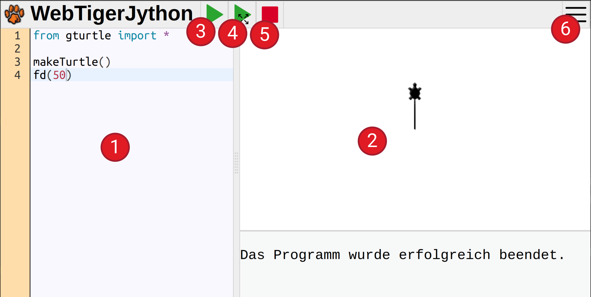

---
title: "Bulme C# Skriptum"
author: [HTL BULME]
date: "2024-10-16"
subject: "C#"
keywords: [Bulme, C#]
book: true
geometry: left=1.5cm,right=1.5cm,top=2cm,bottom=2.5cm
classoption: [openany]
lang: "de"
...

# Einführung

In diesem Kurs lernst du, wie du einen Computer programmieren kannst.
Dabei gehen wir davon aus, dass du noch kein
Vorwissen mitbringst, und werden dir schrittweise alles erklären, was
du dazu brauchst.

## Was heißt "Programmieren" überhaupt?

Programmieren heißt, einer Maschine **Anweisungen** zu erteilen und sie damit zu steuern.
Die erste solche Maschine, die du steuerst, ist eine kleine Schildkröte auf dem Bildschirm: Die Turtle. Die Schildkröte versteht verschiedene Anweisungen um sich zu bewegen,
zu zeichnen oder sich zu verstecken.
Welche Anweisungen existieren und wie diese Anweisungen geschrieben werden müssen,
ist in einer **Programmiersprache** definiert.

Die Programmiersprache, die wir in diesem Kurs lernen werden, ist **C#**.
C# ist eine moderne, objektorientierte Programmiersprache,
die besonders für die Entwicklung von Windows-Anwendungen und Spielen beliebt ist.
Sie wird häufig in der Webentwicklung und für Unternehmenssoftware eingesetzt
und zeichnet sich durch ihre hohe Leistungsfähigkeit aus.
Des Weiteren gibt es eine große Schnittmenge zu anderen Programmiersprachen,
wie Java, C, C++ oder JavaScript, was das Erlernen dieser Sprachen später einfach möglich macht.


## C# mit Roslynpad
Wir werden mit einer einfachen Umgebung starten, um C# zu programmieren.
Diese Umgebung benötigt aber einige Schritt um sie zu installieren.
Befolge folgende Schritte um die Anwendung zu installieren:


### Installation
Zur Installation benötigst du einen aktuellen Computer mit dem Betriebssystem Windows.

Führe folgende Schritte der Reihe nach aus, um Roslynpad zu installieren:

1. Download und Installation der .Net SDK [Download](https://dotnet.microsoft.com/en-us/download/dotnet/thank-you/sdk-8.0.401-windows-x64-installer)
1. Download und Installation des .Net Frameworks [Download](https://dotnet.microsoft.com/en-us/download/dotnet-framework/thank-you/net481-developer-pack-offline-installer)
1. Download von Roslynpad [Download](https://github.com/roslynpad/roslynpad/releases/download/19.1/RoslynPad-windows-x64.zip)
1. Entpacken von RoslynPad
    - Rechtsklick auf die Datei: RoslynPad-windows-x64.zip
    - “Alle Extrahieren” wählen oder “Weitere Optionen” und dann “Alle Extrahieren” wählen
    - Ordner öffnen und Verknüpfung zu RoslynPad.exe auf dem Desktop erstellen
1. RoslynPad starten und konfigurieren
    - Documents fixieren
    - x64 wählen und als Standard setzen
    - BulmeSharp laden
    - Minimalprogramm testen

```cs
Turtle.fd(39);
```

**Tipp:**
Die gesamte Installation wird in diesem [Video](https://bulme-my.sharepoint.com/personal/gl_ms_bulme_at/_layouts/15/stream.aspx?id=%2Fpersonal%2Fgl%5Fms%5Fbulme%5Fat%2FDocuments%2FInstallation%2Emp4&nav=eyJyZWZlcnJhbEluZm8iOnsicmVmZXJyYWxBcHAiOiJTdHJlYW1XZWJBcHAiLCJyZWZlcnJhbFZpZXciOiJTaGFyZURpYWxvZy1MaW5rIiwicmVmZXJyYWxBcHBQbGF0Zm9ybSI6IldlYiIsInJlZmVycmFsTW9kZSI6InZpZXcifX0) vorgezeigt.


### Einführung in die Oberfläche

Die Oberfläche ist einfach gestaltet und speziell für Einsteiger entwickelt worden.
Sie besteht aus folgenden sechs Bereichen.

1. Codeeingabe: Hier gibst du den Python-Code ein
1. Ausgabefenster: Hier siehst du das Ergebnis deines Programms
1. Ausführen: Bei einem Klick auf diesen Knopf wird das Programm ausgeführt
1. Ausführen im Vollbild: Führt das Programm im Vollbild-Modus aus
1. Stop: Beendet das Programm sofort. Das ist notwendig, wenn du siehst,
dass du einen Fehler gemacht hast
1. Einstellungen: Hier kannst du Einstellungen ändern und die Hilfe anzeigen lassen




### 📝 Übung 1
Gib den Programmcode aus der oberen Grafik in RoslyPad ein
und klicke auf den "Ausführen"-Knopf.
Es sollte die gleiche Ausgabe erscheinen wie in der Grafik.


**Tipps:** 
* Achte auf Groß- und Kleinschreibung
* Achte darauf, daß Anweisungen mit einem Strichpunkt (Semikolon) ageschlossen werden müssen
* Achte auf die richtigen Klammern! Es werden in dem Beispiel runde Klammern "(" und ")" benutzt. Eckige "[", "]" oder geschwungene "{", "}" Klammern
bedeuten etwas anderes und funktionieren nicht!
* Wenn du einen Tippfehler gemacht hast, also beispielsweise statt `Turtle.showTurtle()` 
den Text `Turtle.showTrutel()` geschrieben hast, erscheint eine Fehlermeldung im
unteren Teil des Ausgabefensters. Versuche diese zu verstehen und den Fehler zu beheben.
* Beachte folgende Regel beim Programmieren: **Probiere
alles selber aus!** Je mehr Programme du selber schreibst, umso mehr
wirst du verstehen und beherrschen.

## 🧭 Zusammenfassung
Wir haben unsere  erste Umgebung zum Programmieren kennengelernt und
ein erstes Programm eingetippt.
Im nächsten Kapitel erfährst du, welche Anweisungen die Turtle versteht
und wie du interessante Grafiken mit der Turtle zeichnen kannst.

<!---
## Quellen
* https://python-online.ch
* https://programmierkonzepte.ch
* https://tobiaskohn.ch/
-->


